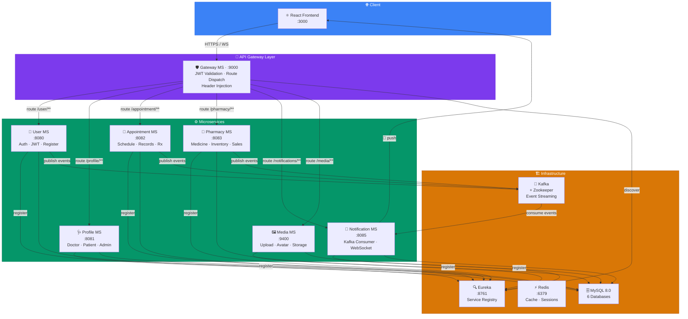
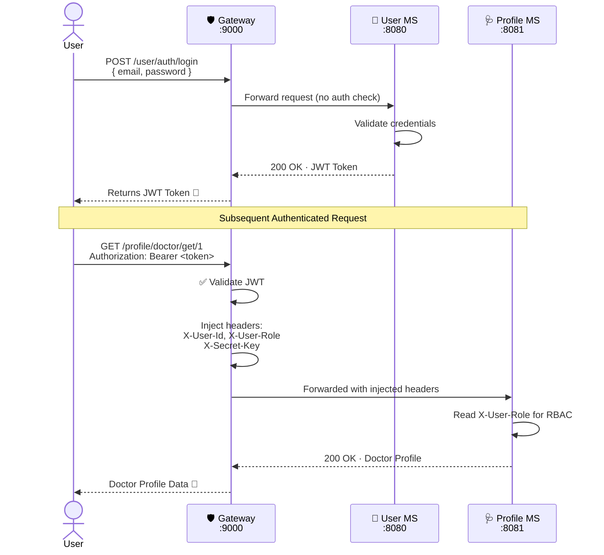
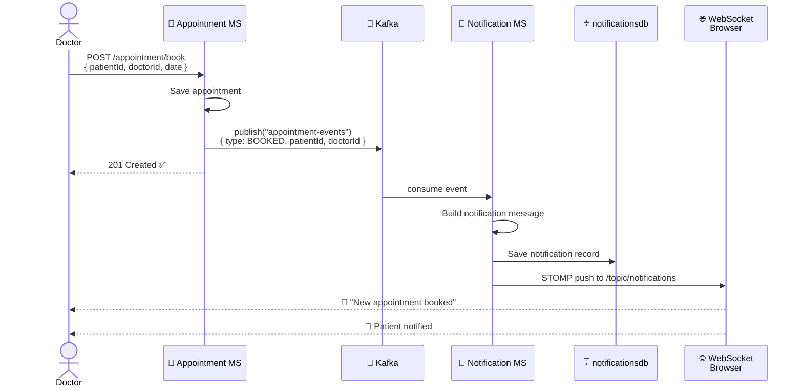

# 🏥 HMS Backend — Hospital Management System

<div align="center">


**A production-ready, event-driven Microservices Hospital Management System**  
Built with Spring Boot 3 · Spring Cloud · Kafka · WebSocket · JWT

</div>

---

## 📐 System Architecture



---

## 🧩 Services At a Glance

| # | Service | Port | Database | Key Responsibilities |
|---|---------|------|----------|---------------------|
| 🔍 | **Eureka Server** | `8761` | — | Service discovery & registry |
| 🛡️ | **Gateway MS** | `9000` | — | JWT auth, routing, header injection |
| 👤 | **User MS** | `8080` | `userdb` | Register, login, JWT issuance |
| 🩺 | **Profile MS** | `8081` | `profiledb` | Doctor & Patient profiles, avatar |
| 📅 | **Appointment MS** | `8082` | `appointmentdb` | Scheduling, clinical records, prescriptions |
| 💊 | **Pharmacy MS** | `8083` | `pharmacydb` | Medicine catalog, inventory, sales |
| 🔔 | **Notification MS** | `8085` | `notificationsdb` | Kafka consumer, WebSocket push |
| 🖼️ | **Media MS** | `9400` | `mediadb` | File upload, protected image serving |

---

## 📖 Swagger API Documentation

> All services are accessible through the **API Gateway on port `:9000`**

| Service | Swagger UI Link |
|---------|----------------|
| 👤 User MS | [`/user/swagger-ui/index.html`](http://localhost:9000/user/swagger-ui/index.html) |
| 🩺 Profile MS | [`/profile/swagger-ui/index.html`](http://localhost:9000/profile/swagger-ui/index.html) |
| 📅 Appointment MS | [`/appointment/swagger-ui/index.html`](http://localhost:9000/appointment/swagger-ui/index.html) |
| 💊 Pharmacy MS | [`/pharmacy/swagger-ui/index.html`](http://localhost:9000/pharmacy/swagger-ui/index.html) |
| 🔔 Notification MS | [`/notifications/swagger-ui/index.html`](http://localhost:9000/notifications/swagger-ui/index.html) |
| 🖼️ Media MS | [`http://localhost:9400/media/swagger-ui/index.html`](http://localhost:9400/media/swagger-ui/index.html) |
| 🔍 Eureka Dashboard | [`http://localhost:8761`](http://localhost:8761) |

---

## 🔐 Authentication Flow



---

## 📬 Event-Driven Notification Pipeline



---

## 🚀 Quick Start

### 🐳 Option A — Docker Compose (Recommended)

```bash
# 1. Clone
git clone https://github.com/Leyla-la/hms-backend.git
cd hms-backend

# 2. Create .env from template
cp .env.example .env
# Edit .env with your credentials

# 3. Build all modules
mvn clean package -DskipTests

# 4. Start everything
docker-compose up -d --build

# 5. Import your database (if migrating)
docker exec -i hms-mysql mysql -u root -p < hms_full_backup.sql
```

✅ That's it! Visit `http://localhost:8761` to verify all services are registered.

---

### 💻 Option B — Run Locally (Manual)

**Step 1 — Create databases**
```sql
CREATE DATABASE userdb;
CREATE DATABASE profiledb;
CREATE DATABASE appointmentdb;
CREATE DATABASE pharmacydb;
CREATE DATABASE mediadb;
CREATE DATABASE notificationsdb;
```

**Step 2 — Start infrastructure**
```bash
docker-compose up -d zookeeper kafka redis
```

**Step 3 — Build**
```bash
mvn clean package -DskipTests
```

**Step 4 — Start services in order**
```bash
# Must start first
java -jar Eureka-Server/target/*.jar

# Then Gateway + Core services
java -jar GatewayMS/target/*.jar
java -jar UserMS/target/*.jar
java -jar ProfileMS/target/*.jar
java -jar AppointmentMS/target/*.jar
java -jar PharmacyMS/target/*.jar
java -jar MediaMS/target/*.jar

# Start last (needs Kafka to be ready)
java -jar NotificationMS/target/*.jar
```

**Or use the startup script:**
```bash
python start_optimized.py
```

---

## 🌱 Environment Variables

Create a `.env` file in the root directory (never commit this file):

```env
# Database
DB_USERNAME=root
DB_PASSWORD=your_mysql_password
DB_ROOT_PASSWORD=your_mysql_password

# Kafka
KAFKA_PORT=9093

# Email Notifications (Brevo SMTP)
BREVO_API_KEY=your_brevo_api_key

# Docker
RESTART_POLICY=unless-stopped
```

| Variable | Description |
|----------|-------------|
| `DB_USERNAME` | MySQL root username |
| `DB_PASSWORD` | MySQL password |
| `BREVO_API_KEY` | Brevo (Sendinblue) SMTP API key for email notifications |
| `KAFKA_PORT` | External Kafka port |
| `RESTART_POLICY` | Docker container restart behavior |

---

## 🗂️ Project Structure

```
hms-backend/
├── 📁 Eureka-Server/       # Service registry
├── 📁 GatewayMS/           # API gateway + JWT filter
├── 📁 UserMS/              # Authentication service
├── 📁 ProfileMS/           # Doctor & Patient profiles
├── 📁 AppointmentMS/       # Clinical scheduling & records
├── 📁 PharmacyMS/          # Medicine & sales
├── 📁 NotificationMS/      # Event-driven notifications
├── 📁 MediaMS/             # File & avatar storage
├── 🐳 docker-compose.yml   # Full stack orchestration
├── 📦 pom.xml              # Parent Maven POM
└── 🔒 .env                 # Local secrets (gitignored ✅)
```

---

## ⚙️ Tech Stack

| Category | Technology |
|----------|-----------|
| Language | Java 17 |
| Framework | Spring Boot 3.x |
| Security | Spring Security + JWT (JJWT) |
| Service Discovery | Netflix Eureka |
| API Gateway | Spring Cloud Gateway |
| Messaging | Apache Kafka + Zookeeper |
| Real-time | WebSocket (STOMP protocol) |
| Database | MySQL 8.0 |
| ORM | Spring Data JPA / Hibernate |
| HTTP Client | OpenFeign |
| Caching | Redis 7.2 |
| Documentation | SpringDoc OpenAPI 3 (Swagger UI) |
| Build | Apache Maven (Multi-Module) |
| Containerization | Docker + Docker Compose |

---

## 🤝 Contributing

```bash
# Create a feature branch
git checkout -b feat/your-feature

# Commit with Conventional Commits
git commit -m "feat(scope): your description"

# Push and open PR to dev branch
git push origin feat/your-feature
```

**Branch naming convention:**
- `feat/` — new features
- `fix/` — bug fixes
- `chore/` — maintenance, config
- `refactor/` — code restructure

---
